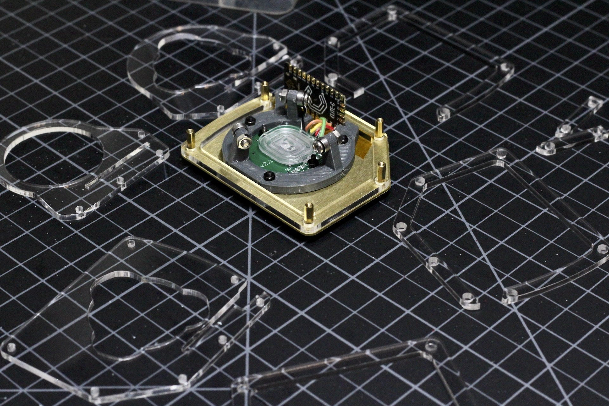
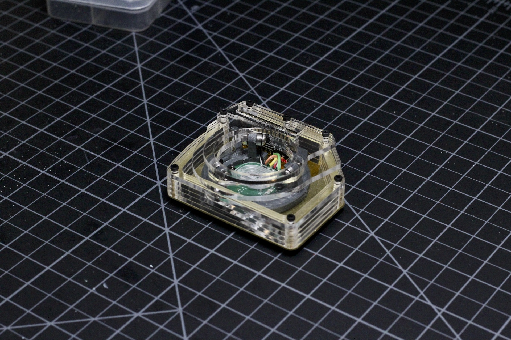

# Build Guide - Acrylic Case

* [Getting Started](../docs/bg_getting_started.md)
* [Electronics](../docs/bg_electronics.md)
* [Structural Assembly](../docs/bg_structure.md)
* Acrylic Case
* [Printed Case](../docs/bg_case_printed.md)
* [Parts list (BOM)](../docs/bom.md)

To keep oriented during througout this guide, here is a photo of everything put together without the case.

### Parts List

For the acrylic version of the case, you'll need seven layers in total.  You can find all the .dxf
files in the /case/laser_cut_stacked directory.  I use Ponoko, and these files are already scaled 
and ready to go.  

If you use elite-c MCU's there is a reset button on the top of the board.  These cases have an 
access hole to reach this button from the side.  That's the reason for the two different 
middle layers.  If you don't want this hole, just use four of the layer A's.  Here is the cut list 
for the cases as pictured with reset hole:

* 2 x middle_a.dxf - Middle piece with no side hole
* 2 x middle_b.dxf - Middle piece with side reset hole
* 1 x top_a.dxf
* 1 x top_b.dxf
* 1 x top_c.dxf

Peel any protective film off the pieces and stack them up!  Put the two middle_b pieces between the two
middle_a pieces and the gap should line up with the reset button on the MCU.  Use the various screw lengths to
secure the layers.  

There ya go!  Make sure you seat the lens properly, drop in the ball and plug it in.  Feel free to 
contact me with any questions on building, flashing or aquiring parts.  If you do build on of these
I'd love to see it.
