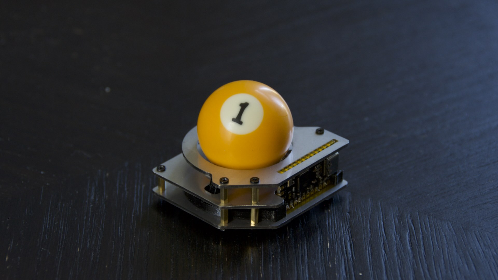

# Build Guide - Plate Case

* [Getting Started](../docs/bg_getting_started.md)
* [Electronics](../docs/bg_electronics.md)
* [Structural Assembly](../docs/bg_structure.md)
* [Acrylic Case](../docs/bg_case_acrylic.md)
* [Printed Case](../docs/bg_case_printed.md)
* Plate Case
* [Parts list (BOM)](../docs/bom.md)

To keep oriented during througout this guide, here is a photo of everything put together without the case.

### Parts List

For the plate version of the case, you'll need three pieces in total.  You can find all the .dxf
files in the /case/laser_cut_plate. You can use metal, acrylic, wood... basically any material.  1.5mm
thickness works great, but you can go a bit thicker/thinner and everything should still work.

* 1 x middle.dxf
* 1 x top.dxf
* 1 x bottom.dxf

You'll need m2 standoffs and screws.  The middle layer must be put in plate BEFORE the bearings!  It's 
also much easier to install the lens before the middle layer is installed.

There ya go! Drop in the ball and plug it in.  Feel free to 
contact me with any questions on building, flashing or aquiring parts.  If you do build on of these
I'd love to see it.
