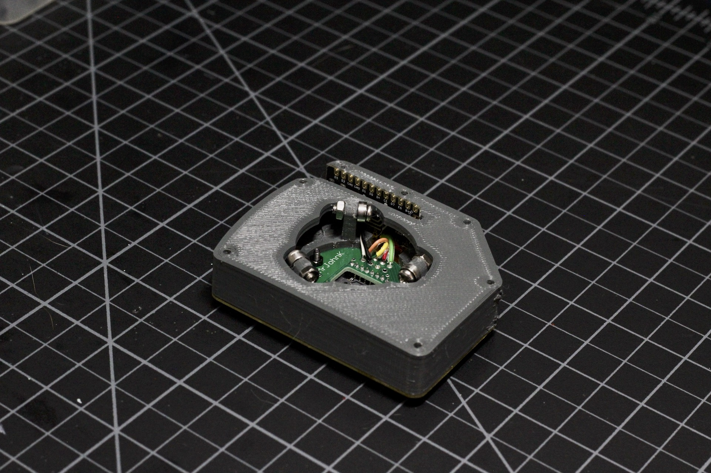
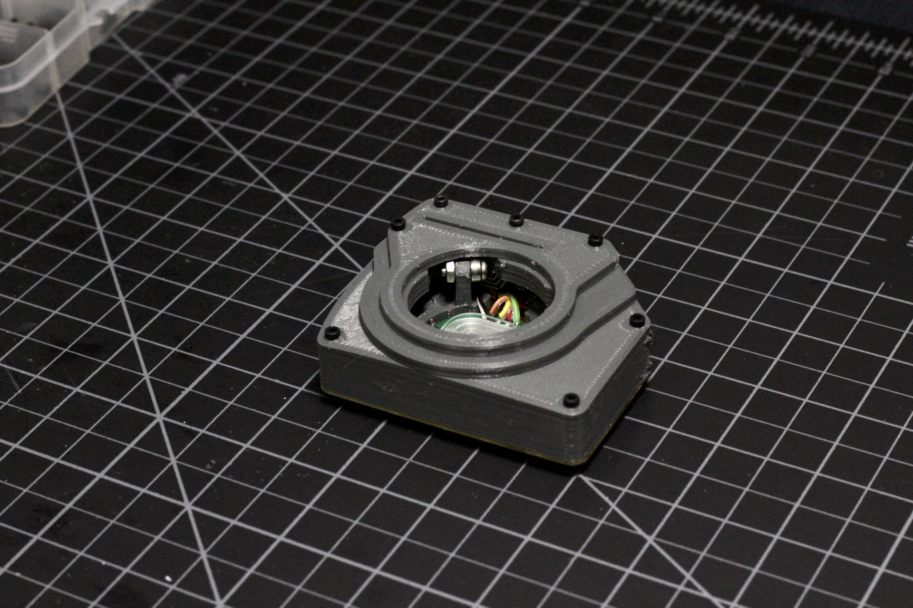

# Build Guide - Printed Case

* [Getting Started](../docs/bg_getting_started.md)
* [Electronics](../docs/bg_electronics.md)
* [Structural Assembly](../docs/bg_structure.md)
* [Acrylic Case](../docs/bg_case_acrylic.md)
* Printed Case
* [Parts list (BOM)](../docs/bom.md)

To keep oriented during througout this guide, here is a photo of everything put together without the case.

### Parts List

For the printed version of the case, you'll need four pieces in total.  You can find all the .stl
files in the /case/printed.  They should all print easily and don't require supports.  Since they are
pretty much all walls/flat surfaces, you can print with high-infill for weight and it won't take 
much longer.

* 1 x middle_top_a.stl
* 1 x top_b.stl
* 1 x top_c.stl

The middle_top piece slides over the stand-offs.  Depending on your printer quality/settings 
you might need to drill out some of the holes to the proper diameter.  

To finish up, the two other top pieces stack on top and you can secure everything with the 
various lengths of screws. 

There ya go!  Make sure you seat the lens properly, drop in the ball and plug it in.  Feel free to 
contact me with any questions on building, flashing or aquiring parts.  If you do build on of these
I'd love to see it.
