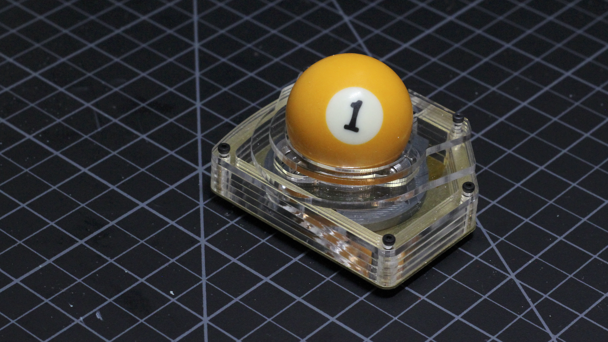

# Build Guide - Getting Started

* [Getting Started](./docs/bg_getting_started.md)
* [Electronics](./docs/bg_electronics.md)
* [Structural Assembly](./docs/bg_structure.md)
* [Acrylic Case](./docs/bg_case_acrylic.md)
* [Printed Case](./docs/bg_case_printed.md)
* [Parts list (BOM)](./docs/bom.md)

