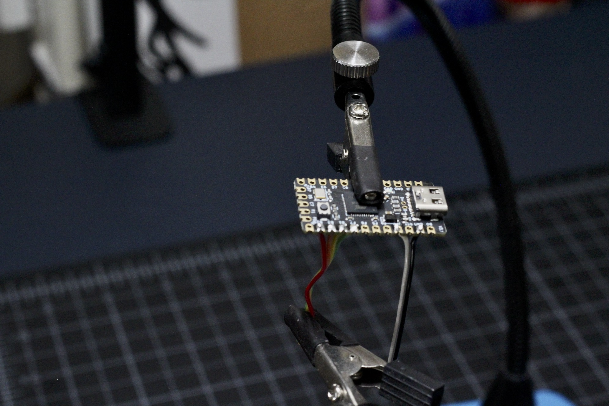
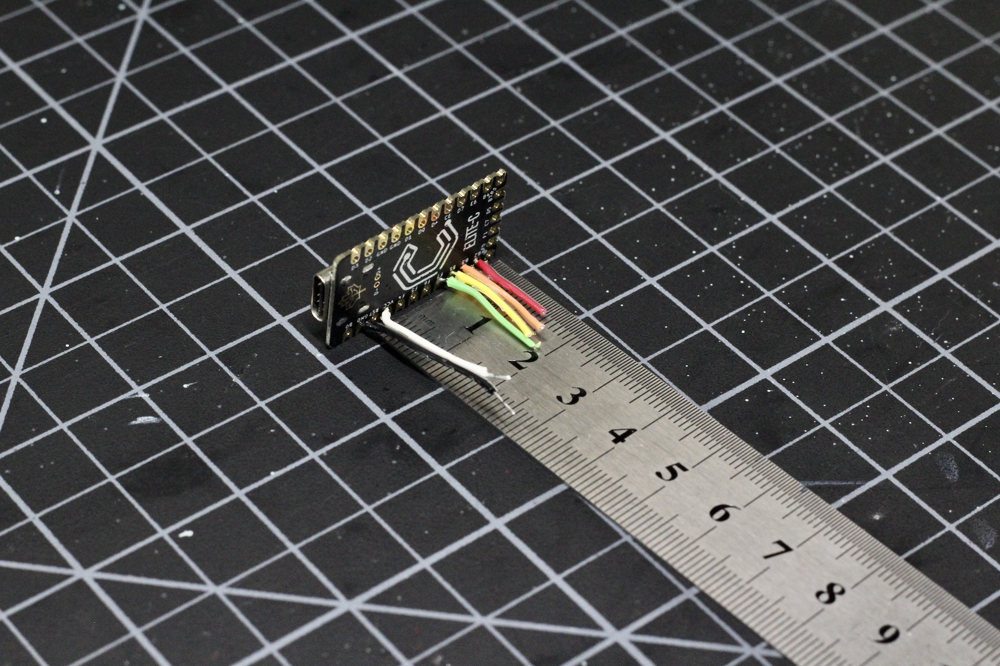

# Build Guide - Electronics

* [Getting Started](../docs/bg_getting_started.md)
* Electronics
* [Structural Assembly](../docs/bg_structure.md)
* [Acrylic Case](../docs/bg_case_acrylic.md)
* [Printed Case](../docs/bg_case_printed.md)
* [Parts list (BOM)](../docs/bom.md)

To keep oriented during througout this guide, here is a photo of everything put together without the case.

## Electronics

There are only the two main components and they are connected with just six wires in two groups.  There are two wires for power, and four which carry the SPI interface lines.  

Note the orientation of the MCU and sensor here.  The wires are coming out the BACK of the MCU, and go into the sensor side of the breakout board.

I suggest connecting your MCU and flashing it with the firmware before you start assembly.  This will let you know that it's functional before you spend time soldering.

### Microcontroller

Any pro-micro compatible will work, in this build I'm using an Elite-C as it has a nice robust USB-C connector.  If you do choose something else, you'll need to work out some way to reset the unit. The Elite-C has an onboard reset button and the cases here
have access holes in the proper place to get at it with the case on.  The opening around the plug may also need adjusting, but it should work with many Micro-USB cables if that is what you decide to use.

### Wiring

The diagram above shows the correct connections to make and the suggested pins to use.

* White: VCC +5v
* Grey: Ground.  Note that this is bridged between the analog and digital ground on the sensor
* Red, Orange, Yellow: SPI Bus connections, these can't be relocated
* Green: Select line... any digital pin will do but this is the most convineint location.

You can see the routing of the wires in the image at the top of this page. I suggest stripping both ends of the wires before starting to solder them.  You have some room to work, but keeping the wires short-ish is helpful.  You'll have to solder these wires from the top side sticking out the back of the MCU.

Here is a photo after all the wires attached to the MCU, with a ruler to show how long I made them.

Make sure you have the sensor oriented correctly, and follow the wiring diagram to finish this step up.

### Testing

This is a great time to the MCU back into your computer.  You can place the lens on top of the sensor unit and just run your finger over the sensor.  You should see the cursor on screen move.  If so, you are all set to go with the mechanical assembly!

* [Structural Assembly](../docs/bg_structure.md)
