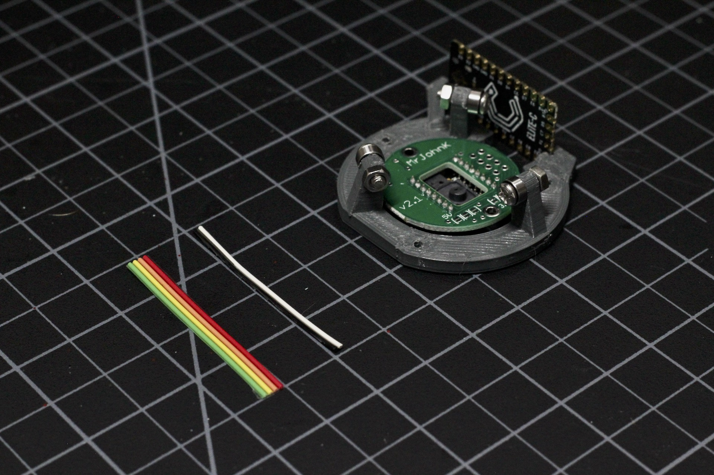
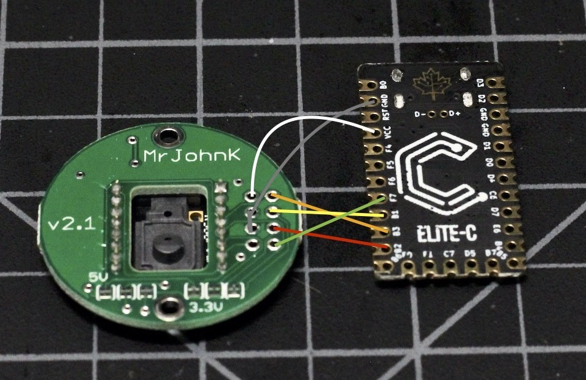

# Build Guide - Getting Started

* [Getting Started](../docs/bg_getting_started.md)
* Electronics
* [Structural Assembly](../docs/bg_structure.md)
* [Acrylic Case](../docs/bg_case_acrylic.md)
* [Printed Case](../docs/bg_case_printed.md)
* [Parts list (BOM)](../docs/bom.md)

To keep oriented during througout this guide, here is a photo of everything put together without the case.

## Electronics

There are only the two main components and they are connected with just six wires in two groups.  There are two wires for power, and four which carry the SPI interface lines.  

### Microcontroller

Any pro-micro compatible will work, in this build I'm using an Elite-C as it has a nice robust USB-C connector.  If you do choose something else, you'll need to work out some way to reset the unit. The Elite-C has an onboard reset button and the cases here
have access holes in the proper place to get at it with the case on.  The opening around the plug may also need adjusting, but it should work with many Micro-USB cables if that is what you decide to use.

### Wiring

