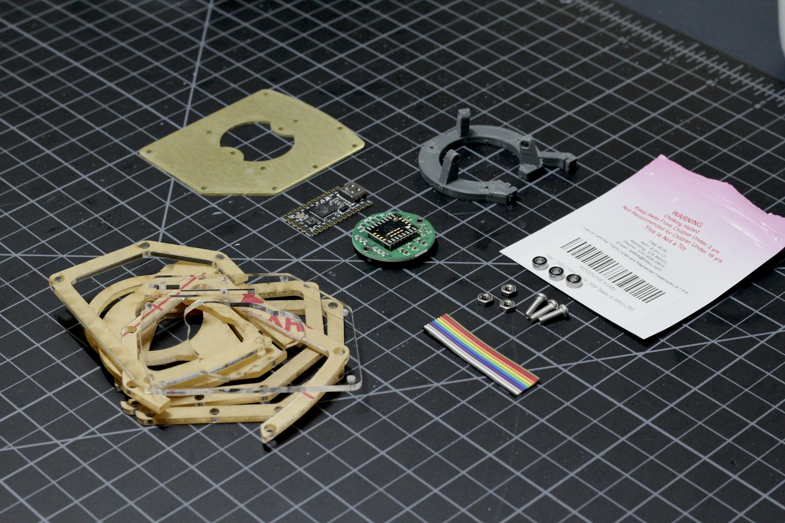
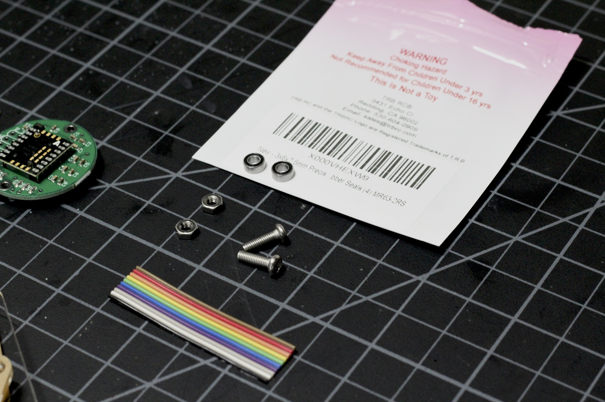

# Build Guide - Getting Started

* Getting Started
* [Electronics](../docs/bg_electronics.md)
* [Structural Assembly](../docs/bg_structure.md)
* [Acrylic Case](../docs/bg_case_acrylic.md)
* [Printed Case](../docs/bg_case_printed.md)
* [Parts list (BOM)](../docs/bom.md)

To keep oriented during througout this guide, here is a photo of everything put together without the case.

## Collect your parts

Here are all the parts required to build an ABall with acrylic case.  See the Parts List above for details.  A case is strictly optional, and I've used protoypes without one....but the bottom plate is essential as it's what everyting else bolts on to.  

### Bearings and Ball - Your point of contact
I've included information about the bearings in the BOM, but here is a closeup of the ones I prefer.  The price difference is not much for pretty much top of the line, and it's really the biggest determiner of feel apart from the ball itself.  The size I selected is fairly common for RC cars, planes, etc.. so you should be able to find a good variety.

As for balls, I've designed this around 38mm balls.  You can go a bit larger, or smaller, and the overall support will work, but cases may not fit properly.  This is a pretty standard size for mini billlard balls, but you an also get full steel ball bearings of this size if you like a heavy roll.  I've tried this, and I can't say I recommend it, but there are plenty of possibilities!  

Now that you have all your pieces together, let's start with the [electronics](./docs/bg_electronics.md)!

