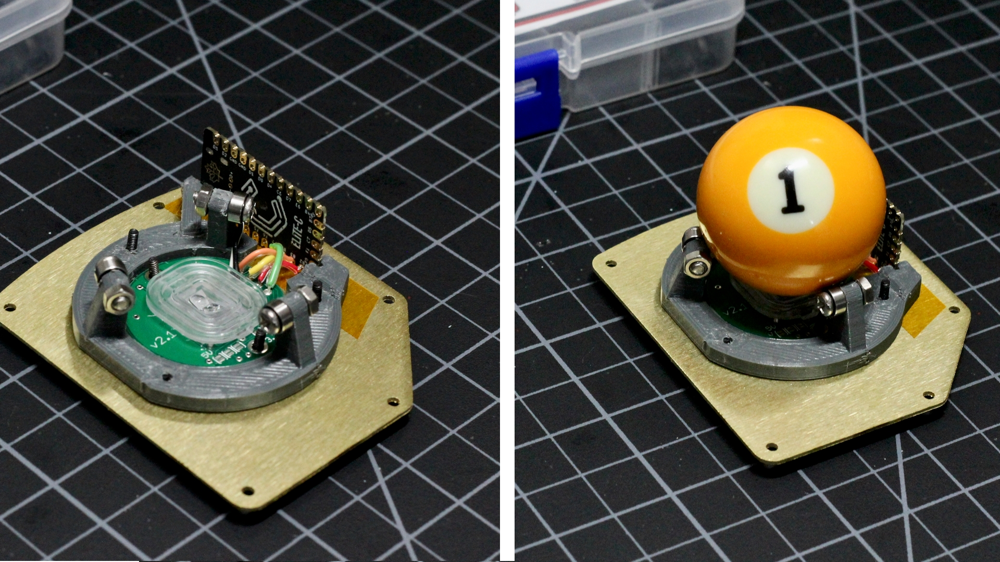
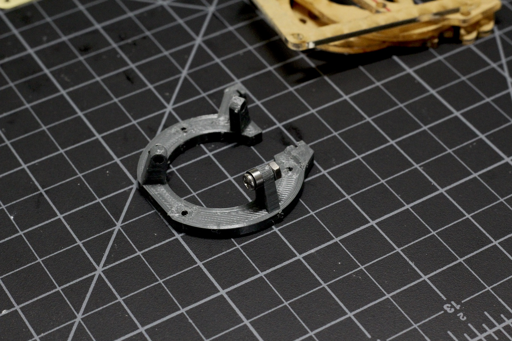
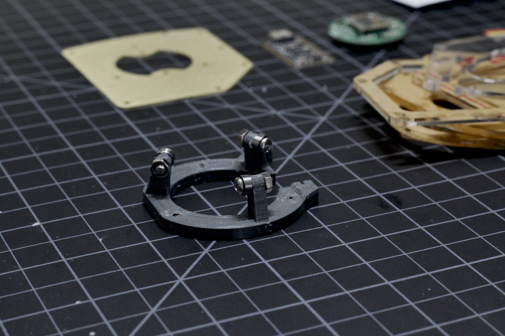
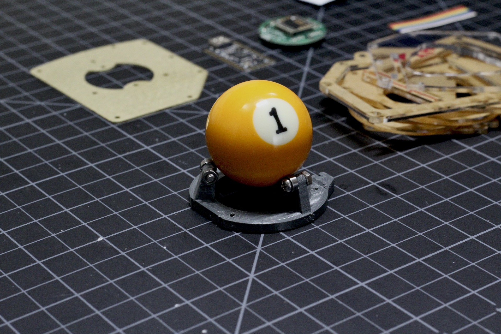

# Build Guide - Structural Assembly

* [Getting Started](../docs/bg_getting_started.md)
* [Electronics](../docs/bg_electronics.md)
* Structural Assembly
* [Acrylic Case](../docs/bg_case_acrylic.md)
* [Printed Case](../docs/bg_case_printed.md)
* [Parts list (BOM)](../docs/bom.md)

To keep oriented during througout this guide, here is a photo of everything put together without the case.

### Print Frame

You'll need to print the vertical_frame.stl file.  It lays flat on the bed and will not require any supports.  It's
pretty small, so you might as well go 100% infill.  Depending on your print quality, you might need to drill out the
holes to fit the screws through.  

### Mount Bearings

Use the M3 round head bolts and nuts to secure the bearings to the frame.  The mount for each bearing is offset so that 
the roller bearings contact the ball properly.  Each bearing needs to be mounted on the clockwise side of the support.  Check the photos if you have any questions.  You can secure these finger tight.

Once they are in place, set the ball on top and everything should roll pretty smoothly.  

You can adjust the tightness of the nuts if they are binding.  The bearings will take some time to break in,
so don't be too concerned if they are a bit scratchy, just check that they roll freely.

### Mount the Feet

### Fit the MCU to the frame

### Secure the Frame / Sensor
